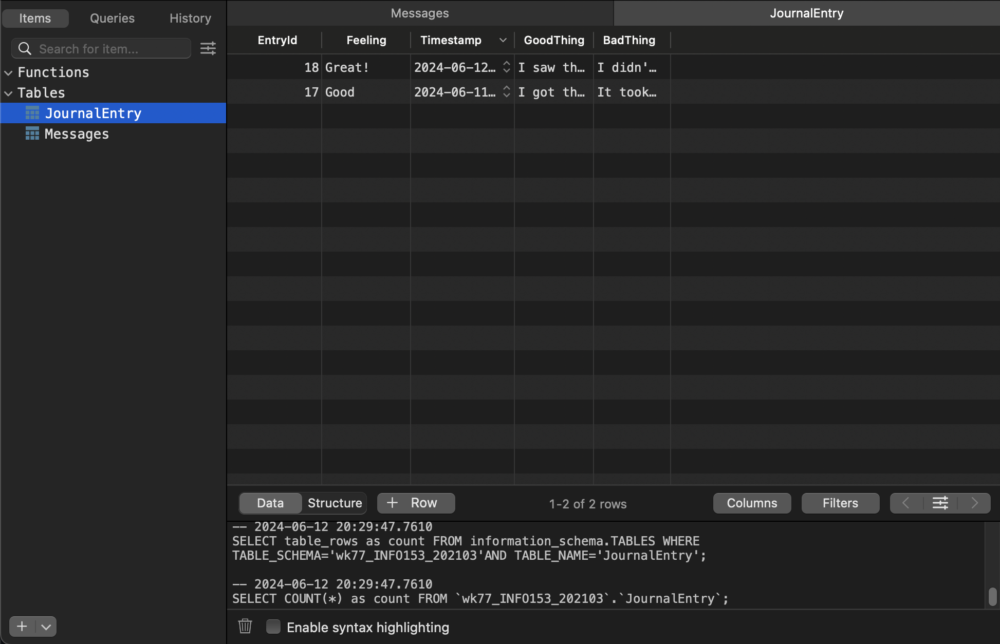

# Mindfull - A Mental Health Tracking App

## Design and Purpose

The Mindfull app provides users a space where they can journal their daily feelings, communicate directly with therapists, and work on their mental health. The app is designed for anyone looking to help with stress from work, school, or everyday life in order to enhance their wellbeing.

## Screenshots

Our user interface is intentionally designed to be simple and clean, using a calming blue and white color scheme.

(insert screenshots here)

### Homepage

The homepage prompts the user to create a journal entry, leading them to the journal entry screen.

### Journal Entry Screen

This screen asks the user to submit three fields:

1. How they're feeling today
2. One good thing that happened to them that day
3. One bad thing that happened to them that day

These journal entries are saved in a MySQL database on TablePlus.

### Messaging Screen

Here, users can send a message to their therapist. Currently, it sends a user's message and then creates a dummy message right after it, so when you click 'receive messages', it displays your message with a "response" from a therapist.

These are also saved in a separate table called "messages".

### Server API design and specification

The API is designed to support the app's functionality with details about its endpoint, supported method (GET/POST), and parameters.

### Message API

- GET: This endpoint retrieves all messages from the database. The server response is a JSON object containing all messages.
- POST: This endpoint posts a new message to the database. The server response is a JSON object with the message "Message inserted".

### Journal API

- GET: This endpoint retrieves all journals from the database. The server response is a JSON object containing all journal entries.
- POST: This endpoint posts a new journal entry to the database. The server response is a JSON object with the message "Journal entry inserted".

For data storage, I used TablePlus, with rows and columns storing the data thats entered. The data is accessed via Drexel CCI's SSH server on my port, 9378.

## Experiences

### Challenges and Solutions

The main challenge was making sure that the user's journal entries and messages were stored in the correct manner and retrieved from the database. I continually fought for this to work and it took a ton of trial and error (and a few youtube videos / lecture videos).

### Future Plans

I want to fully incorporate the ability to login to the app so you can have your own unique ID, the therapist responding will have a different ID so that the messages will go back and forth instead of Lorem Ipsum. I’d love a notification system for the inbox and have this be a fully functioning app in the future.
